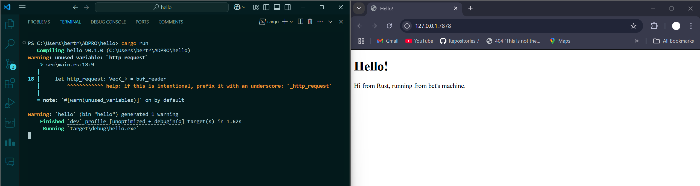
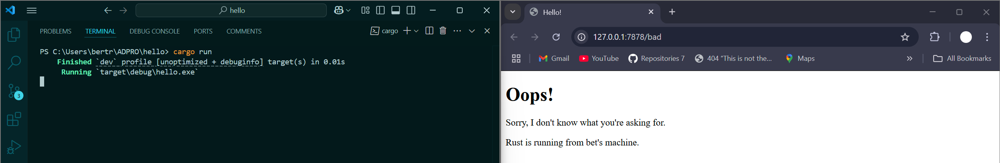

# Reflection Module 6 - Concurrency

## Commit 1 Reflection notes
Fungsi `handle_connection` dalam file `main.rs` bertugas untuk menampilkan _raw HTTP request_ yang dikirimkan ke server. Dalam prosesnya, fungsi ini menerima sebuah `TcpStream` yang bersifat _mutable_ dan kemudian memberikan referensinya ke dalam `BufReader`. `BufReader` membaca aliran data dengan memecah input berdasarkan karakter _newline_ atau CRLF, lalu mengembalikan setiap baris dalam bentuk `Result<String, Error>`. Setiap hasil tersebut di-_unwrapping_ dan diambil nilainya, dengan proses diiterasikan sampai ditemukan baris kosong yang menandai akhir dari bagian _header request_. Data yang diperoleh kemudian dikumpulkan dalam sebuah _vector_ `Vec<_>`, yang kemudian ditampilkan ke layar untuk menunjukkan bagaimana request tersebut disusun oleh browser.

## Commit 2 Reflection notes
Fungsi `handle_connection` yang dimodifikasi mengirimkan _HTTP response_ dengan status `200 OK` dan memuat konten `HTML` yang diambil dari file `hello.html`. File tersebut dibaca menggunakan `fs::read_to_string` untuk mendapatkan konten dalam bentuk string, kemudian panjang konten dihitung dan dimasukkan ke dalam header `Content-Length`. Header `Content-Length` memberikan informasi kepada browser mengenai ukuran data yang dikirim, sehingga browser dapat menampilkan halaman secara utuh. _Response_ diformat sesuai standar HTTP, dimulai dengan _status line_, dilanjutkan header, kemudian baris kosong, dan diakhiri dengan _body_ yang berisi `HTML`. Setelah itu, _response_ dikirim ke _client_ menggunakan `stream.write_all()`.

_Screenshot_ hasil menjalankan modifikasi kode terbaru:

## Commit 3 Reflection notes
Web server sekarang dapat membedakan request ke _root_ ("/") dan _request_ lainnya. Jika _request_-nya adalah `GET / HTTP/1.1`, server mengembalikan halaman dari file `hello.html` dengan status `200 OK`. Untuk _request_ lain, server mengembalikan halaman error dari file `404.html` dengan status `404 NOT FOUND`. Header `Content-Length` berfungsi untuk memberi tahu browser mengenai ukuran _body response_, sehingga halaman dapat ditampilkan dengan baik. _Refactor_ dilakukan dengan mengelompokkan nilai `status_line` dan `filename` ke dalam sebuah tuple melalui blok if-else. Hal ini memungkinkan proses pembacaan file dan pengiriman _response_ dilakukan dalam satu alur, sehingga kode tidak terduplikasi dan lebih mudah dipelihara.

## Commit 4 Reflection notes
Fungsi `handle_connection` telah dimodifikasi untuk menangani _request_ ke `/sleep` dengan menambahkan _delay_ selama 10 detik menggunakan `thread::sleep`. Modifikasi ini dilakukan dengan mengganti blok if-else dengan _match expression_ yang memeriksa nilai `request_line`. Jika `request_line` adalah `GET /sleep HTTP/1.1`, maka server akan menunggu selama 10 detik sebelum mengirimkan _response_. Perubahan ini menunjukkan bahwa server yang berjalan secara _single-thread_ hanya dapat memproses satu _request_ dalam satu waktu, sehingga jika ada _request_ yang lambat, maka _request_ lain harus menunggu hingga proses selesai. Hal ini menunjukkan bahwa penerapan _multithreading_ sangat membantu untuk menangani banyak _request_ secara bersamaan.

## Commit 5 Reflection notes
Fungsi `handle_connection` sekarang tidak lagi dijalankan secara berurutan karena telah dimasukkan ke dalam struktur `ThreadPool` yang mengelola beberapa `Worker` dan komponen pengiriman tugas. `ThreadPool` menyatukan mekanisme distribusi dengan menyediakan sebuah `Sender` yang mengirim `Job` ke _queue_ tugas, sementara setiap `Worker` memiliki `Receiver` yang melalui mekanisme `Arc` dan `Mutex` memastikan bahwa hanya satu `Worker` yang mengambil tugas pada satu waktu. `Job` sendiri merupakan fungsi yang hanya dapat dipanggil satu kali dengan parameter tertentu dan aman untuk dikirim ke _thread_ lain. Melalui _method_ `execute`, fungsi yang diterima diubah menjadi `Job` dan dikirim ke _queue_ sehingga setiap `Worker` yang sedang _idle_ akan segera mengambil dan mengeksekusi tugas tersebut. Ketika terjadi _request_ yang membutuhkan waktu pemrosesan lama, _request_ lain tidak harus menunggu karena dapat langsung ditangani oleh _thread_ yang berbeda dalam _pool_, yang dalam kasus ini memungkinkan server memproses hingga empat permintaan secara sekaligus dan meningkatkan _throughput_ secara keseluruhan.